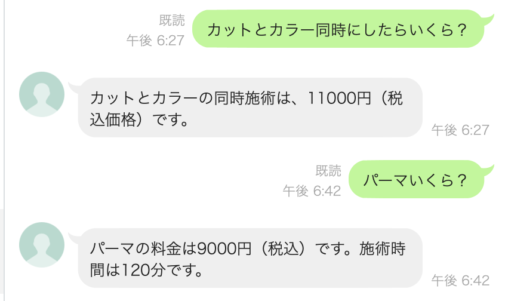
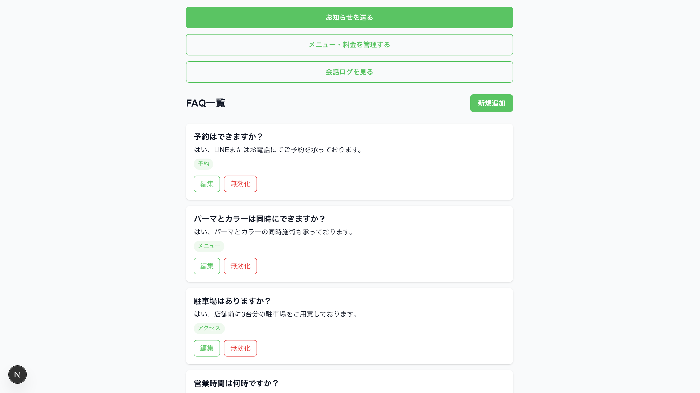
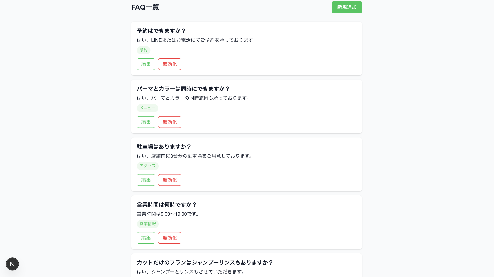
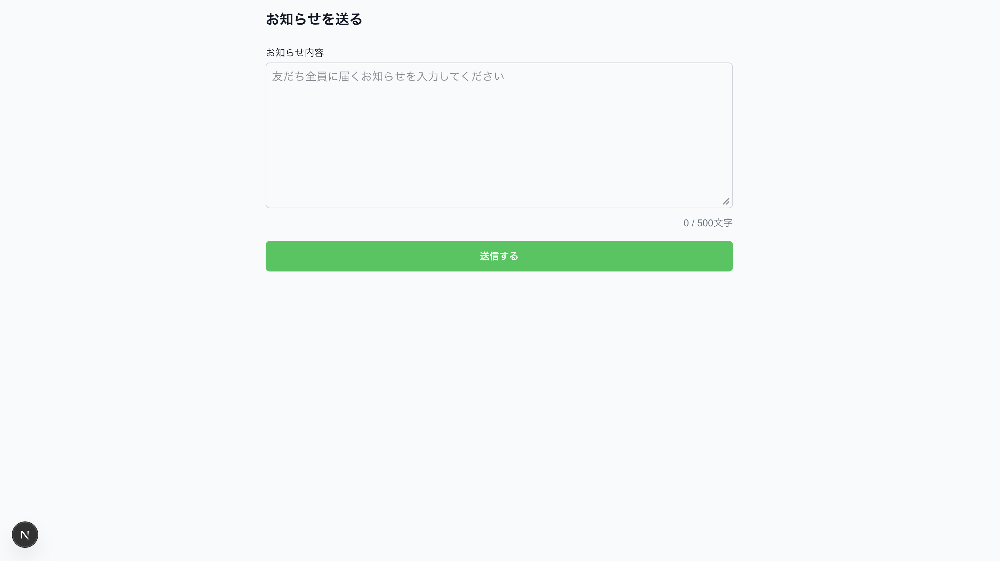
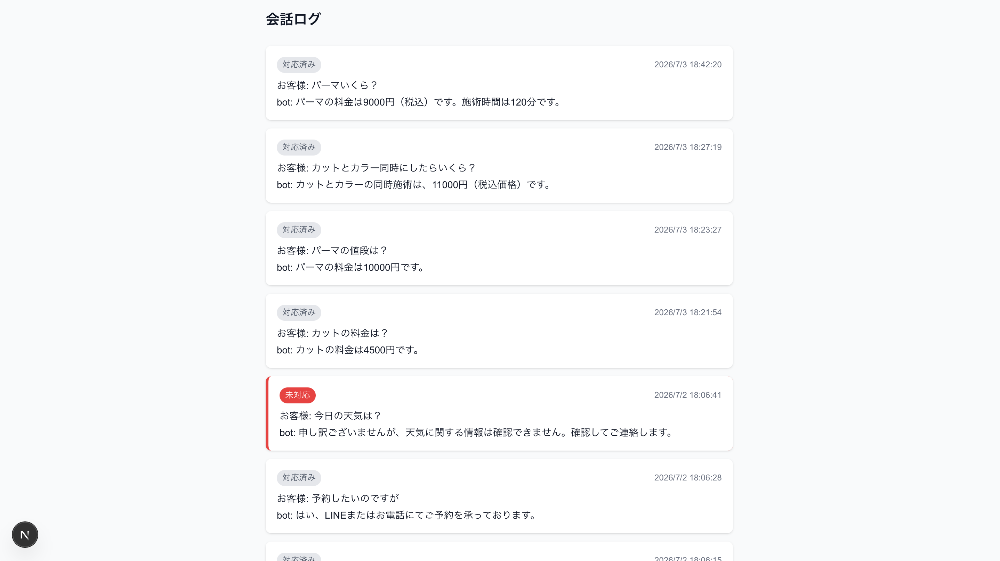

# 美容室向け LINE bot

## 概要
個人経営の美容室向けLINE自動応答botです。
よくある質問への自動回答、オーナーへの通知、
お知らせ一斉配信、管理画面を備えています。

## 機能
- FAQ自動応答（OpenAI gpt-4o-mini）
- 確信度判定（high/medium/low）
- 答えられない質問はオーナーにLINE通知
- お知らせ一斉配信
- 管理画面（FAQ・メニュー・会話ログ管理）

## 技術スタック
- Next.js 16 (App Router) / TypeScript / Tailwind CSS
- LINE Messaging API
- OpenAI API (gpt-4o-mini)
- Supabase
- Vercel

## 画面

### LINE自動応答


### 管理画面トップ


### FAQ一覧


### お知らせ配信


### 会話ログ


## 公開URL
https://salon-bot-dev.vercel.app

## 環境変数
| 変数名 | 説明 |
|---|---|
| LINE_CHANNEL_ACCESS_TOKEN | LINEチャネルアクセストークン |
| LINE_CHANNEL_SECRET | LINEチャネルシークレット |
| OPENAI_API_KEY | OpenAI APIキー |
| NEXT_PUBLIC_SUPABASE_URL | SupabaseプロジェクトURL |
| NEXT_PUBLIC_SUPABASE_ANON_KEY | Supabase anonキー |
| SUPABASE_SERVICE_ROLE_KEY | Supabaseサービスロールキー（サーバー専用） |
| OWNER_LINE_USER_ID | 未回答通知の送信先（オーナーのLINE userId） |

## ドキュメント
- [運用マニュアル（オーナー向け）](docs/manual.md)
- [セットアップ手順書（引き継ぎ用）](docs/setup.md)
- [技術ドキュメント](docs/technical.md)

## 開発環境の起動
```bash
npm install
npm run dev
```

詳細は [docs/setup.md](docs/setup.md) を参照してください。
